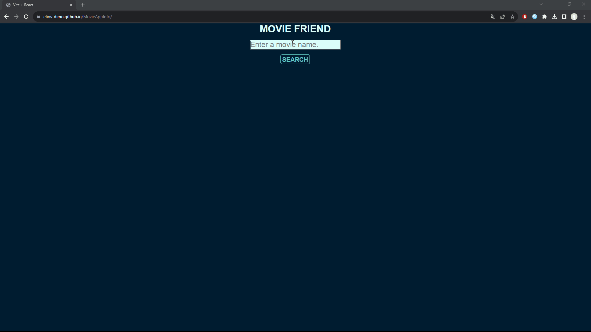

# MovieAppInfo

A movie info app with  where the user enters the name of a movie and gets a list of related ones. 
Clicking one of the movies in the list redirects him to that movie title, year, director, poster and plot.

# Technologies

The project was built in React js making use of html,css and javascript knowledge.

# What I learned and practiced 

- React js components, props
- API fetch (async functions)
- React router
- useState, useEffect, useContext, useParams
